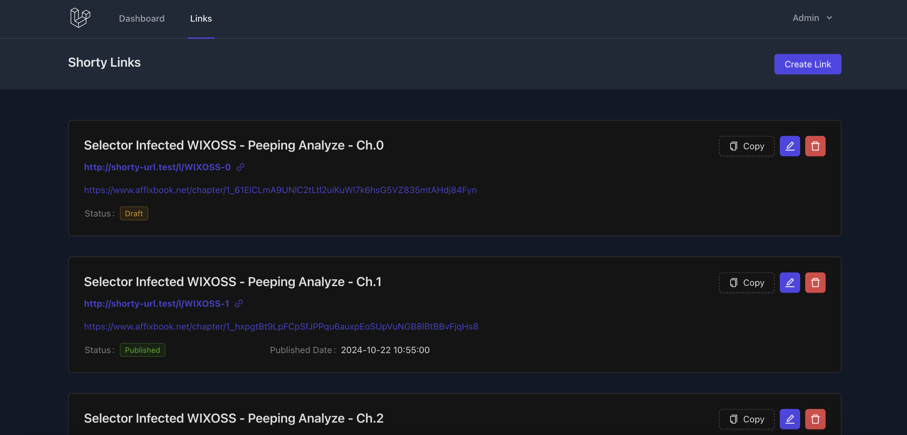
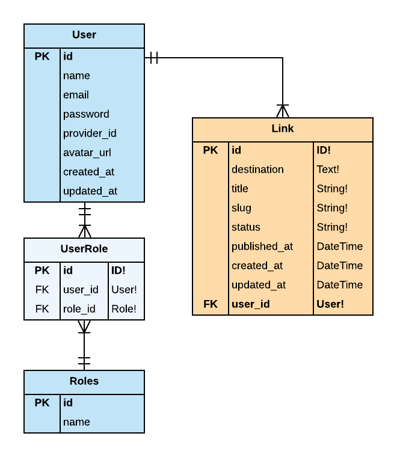

<p align="center"><a href="https://laravel.com" target="_blank"></a></p>

## Shorty URL

Project Shorten URL create with Laravel 11

## Features

- [x] **User Account Module:** Allows users to register and log in with their email or username and password.
- [x] **URL Shortage Module:** Allows users to input the URL to be shortened and keep the output with the shortened link to share with the public.
- [x] **Admin Module:** Allows administrators to see and administrate the links that the users shorten.

## Installation

```sh
git clone https://github.com/Weerapat1993/shorty-url.git
cd shorty-url
composer install
cp .env.example .env
php artisan key:generate
# set mysql db
php artisan migrate --seed
npm install
npm run build
php artisan serve
```

## Result



## ER Diagrams



Excel Database : [Link here](https://docs.google.com/spreadsheets/d/1C2gh892o0tT8NhEIU0y_HcyoCIRZZsdgJX10Arb7xPc/edit?usp=sharing)
